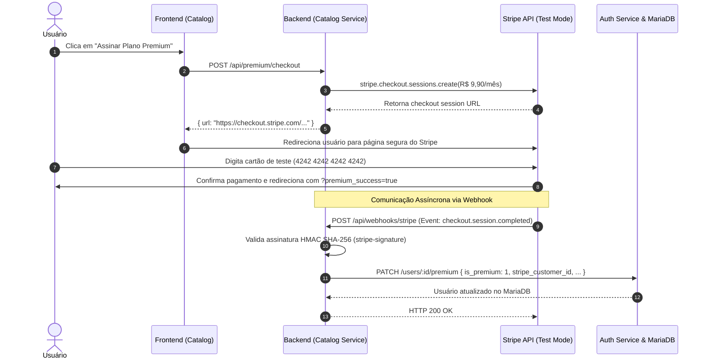

# 🎬 Catálogo de Filmes — Tom Hanks & Rede Social de Cinema
> **ISW055 · Introdução à Computação em Nuvem**  
> Professor: [@siriani](https://github.com/siriani) — [github.com/siriani](https://github.com/siriani)  
> Aplicação em Produção: [https://amabili-flor-isw055.lapps.studio/](https://amabili-flor-isw055.lapps.studio/)

---

## 📑 Sumário das Implementações
1. [Atividade 7: Plano Premium & Cobrança com Stripe](#-1-atividade-7-plano-premium--cobrança-com-stripe)
2. [Atividade 6: Object Storage MinIO & Perfil Social](#-2-atividade-6-object-storage-minio--perfil-social)
3. [Atividade 5: Auditoria com Redis Streams & Observabilidade](#-3-atividade-5-auditoria-com-redis-streams--observabilidade)
4. [Atividade 4: Controle de Acesso por Papel (RBAC)](#-4-atividade-4-controle-de-acesso-por-papel-rbac)
5. [Atividades 2 & 3: Microsserviço de Autenticação com 2FA & Catálogo](#-5-atividades-2--3-autenticação-2fa-e-catálogo)
6. [Documentação Swagger / OpenAPI 3.0](#-6-documentação-swagger--openapi-30)
7. [CI/CD com GitHub Actions](#-7-cicd-com-github-actions)
8. [Como Executar Localmente](#-8-como-executar-localmente)

---

## 💳 1. Atividade 7: Plano Premium & Cobrança com Stripe

O catálogo ganha um modelo de monetização: um **Plano Premium (R$ 9,90/mês)** com cobrança real delegada ao **Stripe** em **Modo de Teste (Test Mode)**.

### 🛡️ Conformidade PCI-DSS & Segurança
- **Zero armazenamento de dados sensíveis de pagamento:** O sistema nunca recebe, processa ou salva números de cartão de crédito, CVV ou datas de validade.
- O checkout acontece na infraestrutura segura do Stripe ou via Checkout Sessions hospedadas.
- O banco de dados MariaDB armazena unicamente identificadores de referência: `is_premium`, `stripe_customer_id`, `stripe_subscription_id`, `premium_since` e `premium_until`.

### 🔄 Arquitetura do Fluxo de Pagamento e Webhooks



### ⭐ Benefícios Reais e Verificáveis do Assinante Premium

| Recurso | Plano Gratuito (`is_premium: 0`) | Plano Premium (`is_premium: 1`) |
| :--- | :--- | :--- |
| **Limite de Favoritos** | **Máximo de 3 filmes** (Backend bloqueia o 4º com `HTTP 403 Forbidden` e código `UPGRADE_REQUIRED`) | **Favoritos Ilimitados** |
| **Selo VIP Comunitário** | Sem selo | Selo dourado `👑 VIP PREMIUM` no Perfil e nos Comentários |
| **Cancelamento** | N/D | Cancelamento a qualquer momento direto pelo painel de perfil (`POST /api/premium/cancel`) |

### 🛠️ Endpoints do Stripe Implementados
- `POST /api/premium/checkout`: Gera uma sessão do Stripe Checkout e retorna a URL de redirecionamento.
- `POST /api/webhooks/stripe`: Rota de webhook com parsing `express.raw({ type: 'application/json' })` e verificação criptográfica `stripe.webhooks.constructEvent(rawBody, signature, secret)`.
- `GET /api/premium/status`: Consulta o status atual da assinatura do usuário logado.
- `POST /api/premium/cancel`: Cancela a assinatura e rebaixa privilégios.
- `POST /api/premium/simulate-webhook`: Simulação local automatizada para testes de ponta a ponta e CI.

---

## 🪣 2. Atividade 6: Object Storage MinIO & Perfil Social

- Armazenamento de fotos de perfil descentralizado no **MinIO S3 Compatible Object Storage**.
- Bucket `perfil-fotos` criado automaticamente na inicialização com política de acesso público para avatares.
- Upload com validação de formato (`image/*`), limite de tamanho (5MB) e redimensionamento/armazenamento com nomes seguros uuid.
- Aba **"Meu Perfil Social"** com biografia personalizada, galeria de favoritos, contador de interações e e-mail real do usuário.

---

## 🪵 3. Atividade 5: Auditoria com Redis Streams & Observabilidade

- Persistência assíncrona de eventos de auditoria usando **Redis Streams** (`XADD audit_logs`).
- Coleta de métricas no padrão **Prometheus** (`GET /metrics`) e verificação de saúde com liveness & readiness (`GET /health`).
- Visualização de logs no painel de administração em tempo real.

---

## 🔐 4. Atividade 4: Controle de Acesso por Papel (RBAC)

O sistema implementa **RBAC (Role-Based Access Control)** com enforcement estrito no backend:

| Recurso / Ação | Endpoint / Método | Papel `usuario` | Papel `admin` | Regra de Autorização |
| :--- | :--- | :---: | :---: | :--- |
| **Favoritar até 3 Filmes** | `POST /api/favorites` | ✅ Permitido | ✅ Permitido | Regra de plano gratuito. |
| **Favoritar Ilimitado** | `POST /api/favorites` | ❌ **403 Upgrade Required** | ✅ Permitido | **Plano Premium Ativo**. |
| **Moderar Comentários** | `DELETE /api/comments/:id` | ❌ **403 Forbidden** | ✅ Permitido | **Exclusivo Admin**. |
| **Gerenciar Usuários** | `GET /api/users`, `PATCH /api/users/:id/role` | ❌ **403 Forbidden** | ✅ Permitido | **Exclusivo Admin**. |
| **Auditoria Redis Streams** | `GET /api/admin/logs` | ❌ **403 Forbidden** | ✅ Permitido | **Exclusivo Admin**. |

---

## 🔑 5. Atividades 2 & 3: Autenticação 2FA e Catálogo

- Microsserviço `auth-service` desacoplado com MariaDB.
- Validação de e-mails reais no cadastro com envio de código OTP de ativação.
- Autenticação em Duas Etapas (**2FA OTP**) a cada login para garantir a segurança da conta.
- Recuperação de senha com tokens temporários criptografados.

---

## 📄 6. Documentação Swagger / OpenAPI 3.0

Todos os endpoints estão especificados e documentados sob o padrão **OpenAPI 3.0**:
- **Catálogo API (Catalog Service):** [`/apidocs`](https://amabili-flor-isw055.lapps.studio/apidocs) ou [`/docs`](https://amabili-flor-isw055.lapps.studio/docs)
- **Arquivo da Especificação:** [`catalog-service/openapi.json`](./catalog-service/openapi.json)
- **Auth Service API:** [`auth-service/openapi.json`](./auth-service/openapi.json)

---

## 🤖 7. CI/CD com GitHub Actions

Pipeline automatizado em [`.github/workflows/ci-cd.yml`](./.github/workflows/ci-cd.yml):
1. **CI:** Execução de testes unitários e de integração (`auth-service/test.js`, `catalog-service/test.js`), validação de contratos OpenAPI e testes de RBAC/Stripe.
2. **CD:** Build de imagens Docker multi-serviço e verificação do `docker-compose.yml`.

---

## 🚀 8. Como Executar Localmente

```bash
# 1. Clonar o repositório
git clone https://github.com/glaffamabili/catalogo-tom-hanks.git
cd catalogo-tom-hanks

# 2. Configurar variáveis de ambiente
cp .env.example .env

# 3. Executar testes automatizados
cd auth-service && npm test && cd ../catalog-service && npm test && cd ..

# 4. Subir todos os serviços com Docker Compose
docker compose up -d --build
```

- **Aplicação Web:** `http://localhost:8200`
- **Swagger UI:** `http://localhost:8200/apidocs`
- **Health Check:** `http://localhost:8200/health`
- **Métricas Prometheus:** `http://localhost:8200/metrics`
- **Console MinIO:** `http://localhost:9001`